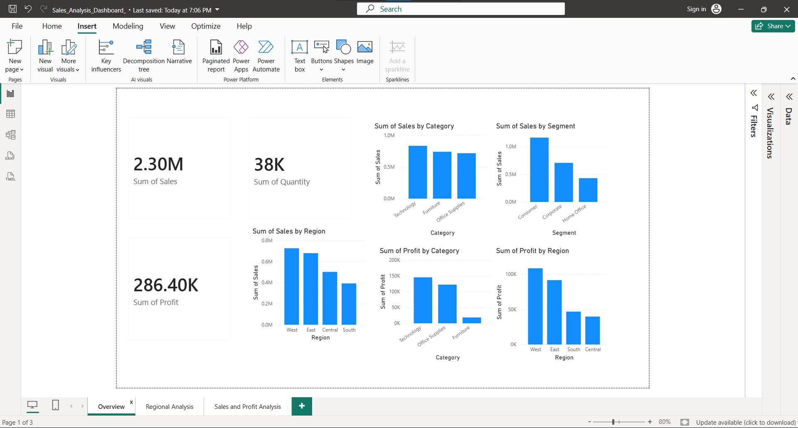
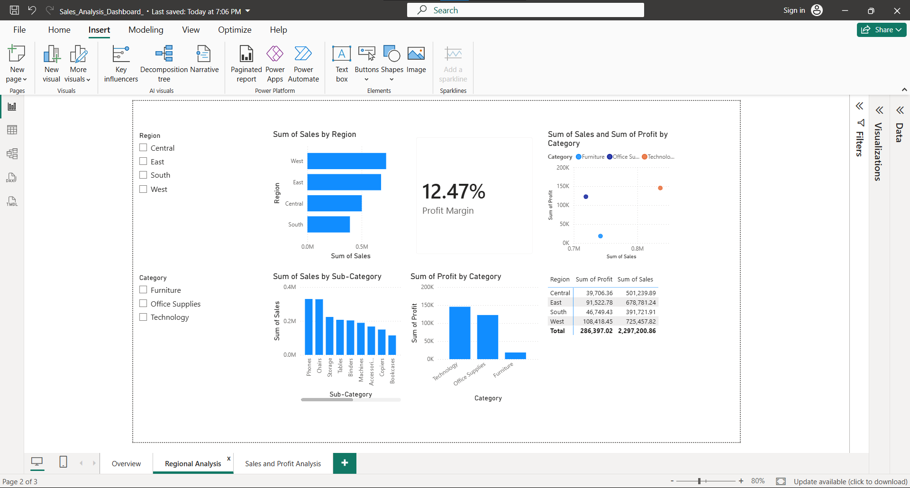
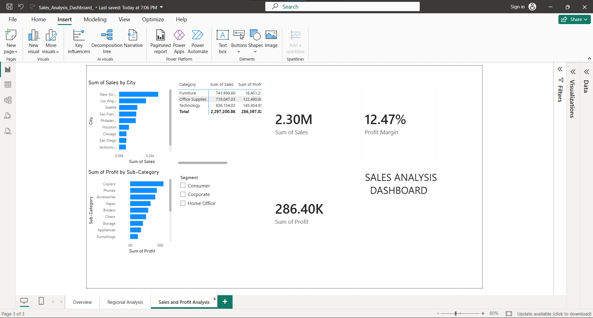

# Sales_Analysis_PowerBI
Sales analysis dashboard built with SQL and Power BI
# Sales Analysis Dashboard — Power BI

## 📊 Project Overview

This project analyzes Superstore sales data using SQL and Power BI.

The goal of the project is to understand sales performance, profitability, customer segments, product categories, regions, and top-performing cities through interactive data visualization.

## 🛠️ Tools & Technologies

- SQL
- Power BI
- DAX
- Data Analysis
- Data Visualization

## 📈 Key Performance Indicators

- Total Sales: 2.30M
- Total Profit: 286.40K
- Total Quantity: 38K
- Profit Margin: 12.47%

## 🔍 Analysis

The dashboard analyzes:

- Sales by Category
- Profit by Category
- Sales by Region
- Profit by Region
- Sales by Sub-Category
- Profit by Sub-Category
- Sales by Segment
- Top 10 Cities by Sales
- Sales and Profit relationships

## 📊 Dashboard Features

- Interactive slicers
- KPI cards
- Bar and column charts
- Matrix analysis
- Scatter chart
- Top N analysis
- DAX measures
- Interactive filtering

## 💡 Key Insights

The dashboard provides an overview of business performance and helps identify:

- The most profitable product categories
- Regional sales and profit performance
- Top-performing cities
- Differences between customer segments
- The relationship between sales and profit

## 📁 Project File

The Power BI dashboard is available in this repository as:

Sales_Analysis_Dashboard.pbix
## 📸 Dashboard Preview

### Overview

### Regional Analysis

### Sales & Profit Analysis

